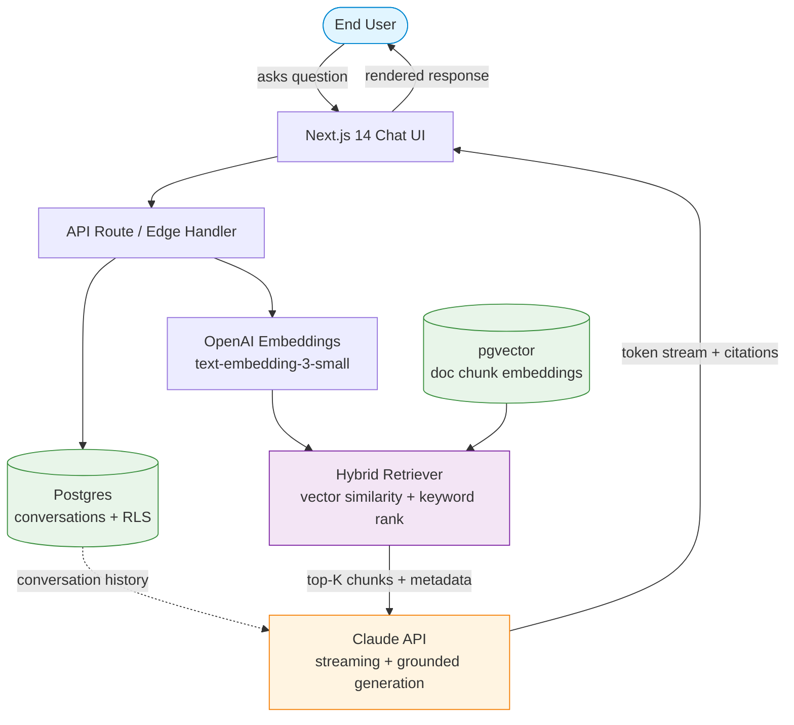
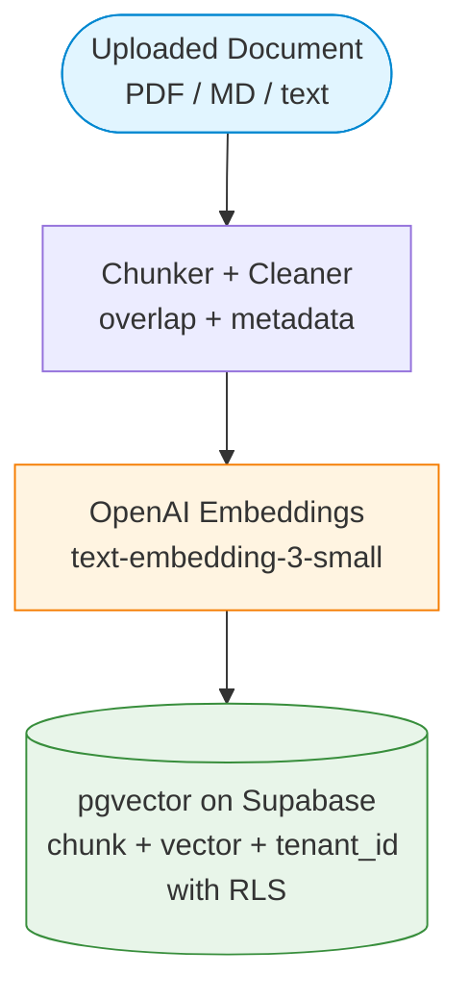

# AI Customer Support Copilot

> **Status:** 🚧 Work in progress — active development

A production-grade customer support assistant that answers user queries grounded in a company's own help documentation, using Retrieval-Augmented Generation (RAG). Built to explore what a "real" RAG system looks like beyond toy demos — with hybrid retrieval, streaming responses, multi-tenant isolation, and cost observability.

---

## Why this project

Most RAG tutorials stop at "embed the docs, do cosine similarity, pass chunks to the LLM." Production systems need more:

- **Relevance beyond semantic match** — pure vector search misses exact-term queries ("error code 402")
- **Grounded answers** — users need to see *where* an answer came from, not just trust the model
- **Multi-tenancy** — one deployment, many customers, hard isolation boundaries
- **Cost awareness** — token spend can spiral without per-conversation tracking

This project implements all four.

---
## Architecture

### Query Path (runs on every user question)

### Ingestion Path (runs once per document upload)

**Flow explained:**

*Query path (when a user asks a question):*
1. User types a question in the Next.js chat UI
2. API route receives the query and fetches conversation history from Postgres (scoped by RLS to the user's tenant)
3. The query is embedded via OpenAI `text-embedding-3-small`
4. Hybrid retriever queries pgvector (semantic similarity) *and* runs keyword ranking, merging results for top-K chunks
5. Retrieved chunks + conversation history are sent to Claude with instructions to generate a grounded, citation-anchored response
6. Claude streams tokens back; the UI renders them live and shows citations inline, linked to the source chunks
7. The full conversation turn is persisted to Postgres for memory and cost tracking

*Ingestion path (when docs are uploaded):*
1. Documents are uploaded and chunked with overlap to preserve semantic context
2. Each chunk is embedded and stored in pgvector alongside its metadata and `tenant_id`
3. Supabase RLS policies enforce that chunks are only retrievable by the owning tenant
---

## Tech Stack

| Layer | Choice | Why |
|---|---|---|
| Framework | Next.js 14 (App Router) | Server components + edge streaming |
| Language | TypeScript | Type safety across RAG pipeline |
| Database | PostgreSQL (Supabase) | Single DB for metadata + vectors |
| Vectors | pgvector | No separate vector DB to operate |
| Embeddings | OpenAI `text-embedding-3-small` | Cost/quality sweet spot |
| LLM | Claude API (Sonnet) | Strong instruction-following + citations |
| Auth & Isolation | Supabase RLS | Per-tenant row-level security |
| UI | shadcn/ui + Tailwind | Clean, fast to iterate |
| Hosting | Vercel | Zero-config edge deploys |

---

## Core Features

- [ ] Document ingestion pipeline (PDF, Markdown, text) with chunking + overlap
- [ ] Embedding generation and pgvector storage
- [ ] Hybrid retrieval — vector similarity + BM25-style keyword ranking
- [ ] Streaming token-by-token responses via Claude API
- [ ] Inline citations linking back to source chunks
- [ ] Conversation memory (multi-turn context) in Postgres
- [ ] Multi-tenant isolation via Supabase RLS
- [ ] Per-conversation token-cost tracking dashboard
- [ ] Structured logging for retrieval and generation steps

---

## Design Decisions (and why)

**Why pgvector, not Pinecone/Weaviate/Qdrant?**
One database to operate. For document corpora under ~1M chunks, pgvector is plenty fast and removes an entire class of sync/consistency issues between metadata and vectors.

**Why hybrid retrieval?**
Pure semantic search fails on exact identifiers — part numbers, error codes, SKU strings. Keyword ranking catches these; vector catches paraphrase. Combining both gives meaningfully better recall.

**Why Claude over GPT?**
Better citation adherence when instructed, and strong long-context performance for multi-chunk grounding. Model choice is swappable via a thin adapter layer.

**Why row-level security instead of separate schemas per tenant?**
Operational simplicity. RLS policies enforce isolation at the DB level without schema sprawl. Scales to hundreds of tenants cheaply.

---

## Roadmap

- **Phase 1 (current):** Ingestion + basic RAG + streaming
- **Phase 2:** Hybrid retrieval, citations, conversation memory
- **Phase 3:** Multi-tenant isolation + cost tracking dashboard
- **Phase 4:** Eval harness (retrieval precision/recall on a held-out question set)

---

## Local Development

Setup instructions will be added once the first working prototype lands.

---

## Author

Built by [Prvind Panday](https://github.com/pravindpanday) — Senior Software Engineer focused on full-stack + AI systems.
